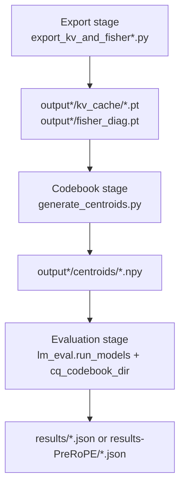

# LLMSim-CQ-zzy

This project extends `lm-evaluation-harness` to reproduce and evaluate:

- Coupled Quantization (CQ) for KV-cache
- RTN per-tensor baseline
- Main model target: `meta-llama/Llama-3.1-8B`

---

## Overview

Modern LLM inference is often bottlenecked by KV-cache memory bandwidth.  
This repository studies whether KV-cache can be compressed aggressively while preserving downstream task quality.

The pipeline includes:

1. Exporting KV activations and Fisher statistics
2. Learning Fisher-weighted codebooks
3. Running CQ/FP/RTN evaluations in `lm_eval`

---

## Quick Start

Run a full Post-RoPE CQ pipeline (example: `4c8b`) from scratch:

```bash
cd .

# 1) Export KV activations + Fisher diagonal
python export_kv_and_fisher.py \
  --model meta-llama/Meta-Llama-3.1-8B \
  --output_dir ./output/llama-3.1-8b-4c8b \
  --num_samples 16 \
  --max_seq_len 2048 \
  --dataset wikitext \
  --dataset_config wikitext-2-raw-v1 \
  --num_coupled_channels 4 \
  --num_bits 8 \
  --key_export_domain post_rope

# 2) Train layer-wise codebooks
for i in $(seq 0 31); do
  python generate_centroids.py \
    --data_path ./output/llama-3.1-8b-4c8b \
    --layer_idx $i \
    --output_dir ./output/llama-3.1-8b-4c8b/centroids
done

# 3) Evaluate Winogrande with CQ
python -m lm_eval.run_models --model hf \
  --model_args pretrained=meta-llama/Llama-3.1-8B,cq_codebook_dir=./output/llama-3.1-8b-4c8b/centroids,cq_rope_mode=postrope,attn_implementation=eager \
  --tasks winogrande \
  --batch_size auto \
  --device cuda:7 \
  --output_path results/llama-3.1-8b/cq_4c8b_winogrande_optimized.json
```

Quick baseline runs:

```bash
bash test_baseline_winogrande_llama3.1-8b.sh
bash test_rtn_winogrande_llama3.1-8b.sh
```

---

## Dataset Sources

This project uses datasets loaded through Hugging Face `datasets`:

- **Calibration / Fisher collection**
  - Dataset ID: `wikitext`
  - Config: `wikitext-2-raw-v1`
  - Accessed via `datasets.load_dataset(...)` in export scripts
- **Downstream evaluation**
  - Dataset ID: `winogrande`
  - Config: `winogrande_xl`
  - Accessed through `lm_eval` task `winogrande`

Useful references:

- [Hugging Face Datasets](https://huggingface.co/docs/datasets)
- [WikiText dataset card](https://huggingface.co/datasets/Salesforce/wikitext)
- [Winogrande dataset card](https://huggingface.co/datasets/allenai/winogrande)

---

## Environment Setup

### Python and installation

- Required Python: `>=3.9` (recommended `3.10` or `3.12`)

```bash
cd .
conda create -n vq python=3.10 -y
conda activate vq
pip install -U pip setuptools wheel
pip install -e .
pip install sentencepiece
```

### Key dependencies from `pyproject.toml`

Main dependencies include:

- `torch>=1.8`
- `transformers>=4.1`
- `datasets>=2.16.0,<4.0`
- `accelerate>=0.26.0`
- `evaluate>=0.4.0`
- `peft>=0.2.0`
- `scikit-learn>=0.24.1`
- `sacrebleu>=1.5.0`
- `pybind11>=2.6.2`

### Pre-run checks

- Ensure Hugging Face access permissions for Llama models
- Ensure `CUDA_VISIBLE_DEVICES` and `--device` are consistent
- Use separate output directories per experiment to avoid overwrite

---

## Architecture Overview

### Core files

- `export_kv_and_fisher.py`: export KV + Fisher (Post-RoPE flow)
- `export_kv_and_fisher_PreRoPE.py`: export KV + Fisher (Pre-RoPE flow)
- `generate_centroids.py`: Fisher-weighted K-means codebook learning
- `lm_eval/models/huggingface.py`: parses `cq_codebook_dir`, `cq_rope_mode`, `rtn_pertensor_bits`
- `lm_eval/quantization/cq_cache.py`: Post-RoPE CQ runtime cache
- `lm_eval/quantization/cq_cache_PreRoPE.py`: Pre-RoPE CQ runtime cache
- `RTN_pertensor_baseline.py`: RTN baseline quantization logic

### Core directories

- `results/llama-3.1-8b/`: baseline + RTN + Post-RoPE CQ results
- `results-PreRoPE/llama-3.1-8b/`: Pre-RoPE CQ results
- `output/`: Post-RoPE intermediate artifacts (ignored)
- `output-PreRoPE/`: Pre-RoPE intermediate artifacts (ignored)

### Dataflow



---

## Pre-RoPE vs Post-RoPE

- **Post-RoPE**
  - Export key domain: `key_export_domain=post_rope`
  - Runtime mode: `cq_rope_mode=postrope`
  - Backend: `lm_eval/quantization/cq_cache.py`

- **Pre-RoPE**
  - Export key domain: `key_export_domain=pre_rope`
  - Runtime mode: `cq_rope_mode=prerope`
  - Backend: `lm_eval/quantization/cq_cache_PreRoPE.py`

---

## Current Results (Winogrande)

Metric: `acc,none`

### Baselines

| Method | Setting | Acc |
|---|---|---|
| FP baseline | no quantization | 0.738753 |
| RTN baseline | `rtn_pertensor_bits=4` | 0.491713 |

### CQ Post-RoPE (`cq_rope_mode=postrope`)

| CQ Config | Acc | Delta vs FP |
|---|---|---|
| 2c4b | 0.677190 | -0.061563 |
| 4c4b | 0.485399 | -0.253354 |
| 2c8b | 0.731650 | -0.007103 |
| 4c8b | 0.644830 | -0.093923 |
| 8c8b | 0.521705 | -0.217048 |

### CQ Pre-RoPE (`cq_rope_mode=prerope`)

| CQ Config | Acc | Delta vs FP | Delta vs Post-RoPE |
|---|---|---|---|
| 2c4b | 0.710339 | -0.028414 | +0.033149 |
| 4c4b | 0.550908 | -0.187845 | +0.065509 |
| 2c8b | 0.732439 | -0.006314 | +0.000789 |
| 4c8b | 0.700079 | -0.038674 | +0.055249 |
| 8c8b | 0.557222 | -0.181531 | +0.035517 |

### Recorded result files

- `results/llama-3.1-8b/baseline/baseline_winogrande_optimized_2026-04-09T01-55-36.387529.json`
- `results/llama-3.1-8b/baseline/rtn_pertensor_winogrande_2026-04-11T06-27-37.189420.json`
- `results/llama-3.1-8b/cq_2c4b_winogrande_optimized_2026-04-23T11-35-08.364614.json`
- `results/llama-3.1-8b/cq_4c4b_winogrande_optimized_2026-04-23T23-34-37.722714.json`
- `results/llama-3.1-8b/cq_2c8b_winogrande_optimized_2026-04-28T08-18-55.394482.json`
- `results/llama-3.1-8b/cq_4c8b_winogrande_optimized_2026-04-26T05-46-50.233213.json`
- `results/llama-3.1-8b/cq_8c8b_winogrande_optimized_2026-04-28T08-31-29.181234.json`
- `results-PreRoPE/llama-3.1-8b/cq_2c4b_winogrande_PreRoPE_optimized_2026-04-28T08-33-54.956851.json`
- `results-PreRoPE/llama-3.1-8b/cq_4c4b_winogrande_PreRoPE_optimized_2026-04-28T04-57-24.728109.json`
- `results-PreRoPE/llama-3.1-8b/cq_2c8b_winogrande_PreRoPE_optimized_2026-04-28T02-03-54.657510.json`
- `results-PreRoPE/llama-3.1-8b/cq_4c8b_winogrande_PreRoPE_optimized_2026-04-23T11-47-07.678534.json`
- `results-PreRoPE/llama-3.1-8b/cq_8c8b_winogrande_PreRoPE_optimized_2026-04-28T00-24-33.009171.json`

---

## Reproducible Implementation Steps

Recommended order:

1. Choose config (`2c/4c/8c`, `4b/8b`, pre/post RoPE)
2. Export KV + Fisher
3. Train all 32 layer codebooks
4. Run CQ evaluation
5. Run FP and RTN baselines
6. Compare JSON outputs

### Step 1: Export KV + Fisher (example `4c8b`)

Post-RoPE:

```bash
python export_kv_and_fisher.py \
  --model meta-llama/Meta-Llama-3.1-8B \
  --output_dir ./output/llama-3.1-8b-4c8b \
  --num_samples 16 \
  --max_seq_len 2048 \
  --dataset wikitext \
  --dataset_config wikitext-2-raw-v1 \
  --num_coupled_channels 4 \
  --num_bits 8 \
  --key_export_domain post_rope
```

Pre-RoPE:

```bash
python export_kv_and_fisher_PreRoPE.py \
  --model meta-llama/Meta-Llama-3.1-8B \
  --output_dir ./output-PreRoPE/llama-3.1-8b-4c8b \
  --num_samples 16 \
  --max_seq_len 2048 \
  --dataset wikitext \
  --dataset_config wikitext-2-raw-v1 \
  --num_coupled_channels 4 \
  --num_bits 8 \
  --key_export_domain pre_rope
```

### Step 2: Train 32-layer codebooks

```bash
for i in $(seq 0 31); do
  python generate_centroids.py \
    --data_path ./output/llama-3.1-8b-4c8b \
    --layer_idx $i \
    --output_dir ./output/llama-3.1-8b-4c8b/centroids
done
```

### Step 3: Evaluate CQ on Winogrande

Post-RoPE:

```bash
python -m lm_eval.run_models --model hf \
  --model_args pretrained=meta-llama/Llama-3.1-8B,cq_codebook_dir=./output/llama-3.1-8b-4c8b/centroids,cq_rope_mode=postrope,attn_implementation=eager \
  --tasks winogrande \
  --batch_size auto \
  --device cuda:7 \
  --output_path results/llama-3.1-8b/cq_4c8b_winogrande_optimized.json
```

Pre-RoPE:

```bash
python -m lm_eval.run_models --model hf \
  --model_args pretrained=meta-llama/Llama-3.1-8B,cq_codebook_dir=./output-PreRoPE/llama-3.1-8b-4c8b/centroids,cq_rope_mode=prerope,attn_implementation=eager \
  --tasks winogrande \
  --batch_size auto \
  --device cuda:7 \
  --output_path results-PreRoPE/llama-3.1-8b/cq_4c8b_winogrande_PreRoPE_optimized.json
```

### Step 4: Run baselines

```bash
bash test_baseline_winogrande_llama3.1-8b.sh
bash test_rtn_winogrande_llama3.1-8b.sh
```

### Reproducibility checklist

- Logs include `Enabled CQ KV-cache quantization`
- `centroids/` contains complete 32-layer `k/v` files
- Output JSON `model_args` has correct `cq_codebook_dir` and `cq_rope_mode`
- Each experiment uses an isolated output directory

---

## Large Artifact Policy

`output/` and `output-PreRoPE/` are intentionally not pushed because they contain very large artifacts:

- `kv_cache/sample*_layer*_key.pt`
- `kv_cache/sample*_layer*_value.pt`
- `centroids/k_centroids_fisher_layer*.npy`
- `centroids/v_centroids_fisher_layer*.npy`

These are ignored in `.gitignore` and should be stored locally or in external storage.

---

## Implementation TODO

- [ ] Add one unified sweep script for `(2c,4c,8c) x (4b,8b) x (pre/post_rope)`
- [ ] Unify output naming (`result/` vs `results/`)
- [ ] Add automatic result table generation from JSON files
- [ ] Add environment lock file for stronger reproducibility
- [ ] Add minimal CI smoke test for CQ integration